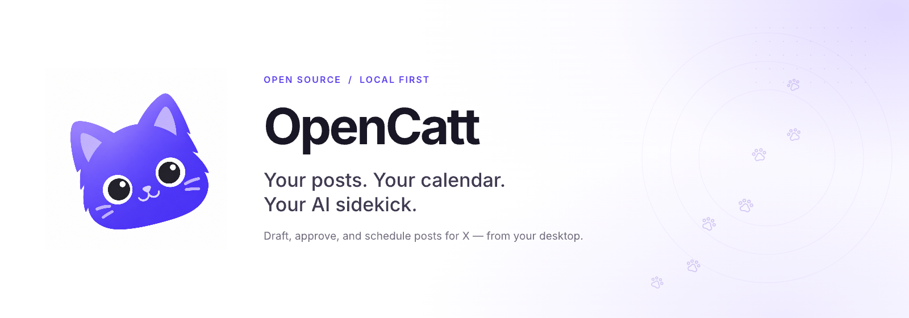
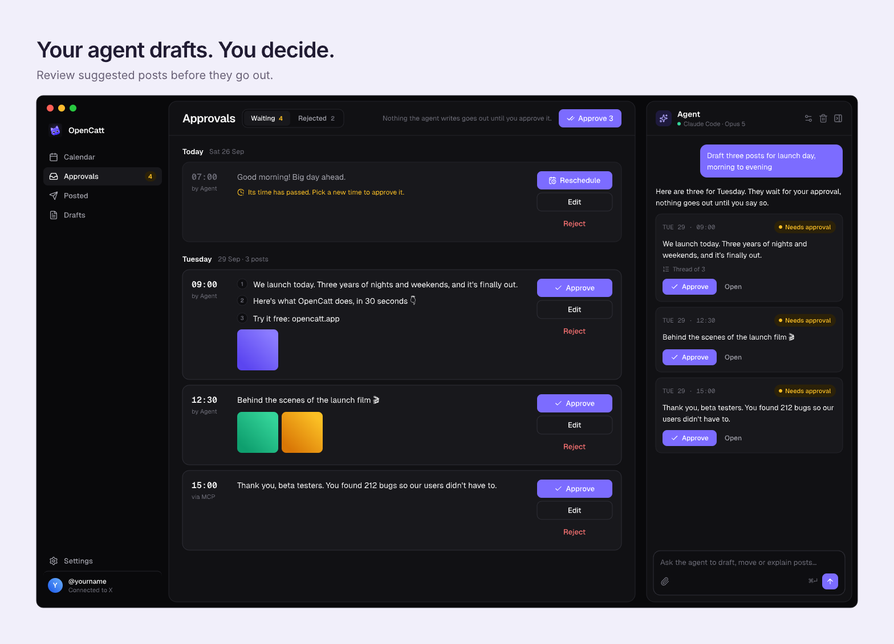

<p align="center">
  
</p>

<p align="center">
  <b>Draft, approve and schedule posts for X from your desktop.</b><br>
  Open source, local first, for Windows, macOS and Linux.
</p>

<p align="center">
  <a href="LICENSE"></a>
  
  
</p>

OpenCatt is an open source desktop app that keeps your X posts on a calendar and gives you an AI
agent to write them with. The agent runs through your own Claude Code, so there is
no API key to buy, and nothing it writes goes out until you approve it. Your posts, drafts and
chat live in a SQLite file on your machine, and your X keys stay in the OS keychain.

> OpenCatt is in early development. The calendar, the Approvals page and the agent panel shown
> here work today. X login, the background publisher, the day board redesign and the new onboarding
> are still being built.

## A calendar for your next idea


Every day on the calendar shows what is scheduled, waiting for approval and already posted. Open
a day to write, edit, reschedule or delete posts, with single posts, threads of up to 25 parts
and images.

## Your agent drafts. You decide.



Ask the agent in the side panel to draft a week of posts, move one to Friday or explain why a post
failed. Everything it writes lands on the Approvals page, where you approve, edit or reject it.
Outside agents can do the same through OpenCatt's MCP server, and their posts wait for you too.

## Features

- Calendar with day boards for scheduled, pending and posted posts
- Chat agent through the local `claude` CLI, on your existing Claude plan
- Approval step for every post an agent writes, in the app or over MCP
- Threads and image attachments, and soon images the agent designs for you
- Your own X developer app, set up with a step-by-step guide on first run
- Local SQLite storage, secrets in the OS keychain through Electron's `safeStorage`

## Install

Download the installer for your system from the
[latest release](https://github.com/2yuri/opencatt/releases/latest). The builds aren't signed
with a paid certificate yet, so your system warns the first time you open OpenCatt.

**macOS** (`OpenCatt-<version>-mac-arm64.dmg` for Apple Silicon, `-x64` for Intel). Open the dmg
and drag OpenCatt to Applications. The first time you open it, macOS says "Apple could not verify
'OpenCatt' is free of malware". Click Done, then open System Settings > Privacy & Security,
scroll down to the message about OpenCatt, click Open Anyway and confirm. Or, before you open the
dmg, clear the download flag in Terminal, and the app copied from it opens normally:
`xattr -d com.apple.quarantine ~/Downloads/OpenCatt-*.dmg`. Don't run it on
/Applications/OpenCatt.app instead: macOS protects apps there, and it fails with "Operation not
permitted".

**Windows** (`OpenCatt-<version>-win-setup-x64.exe`). SmartScreen says "Windows protected your
PC". Click More info, then Run anyway, and follow the installer.

**Linux** (x64). The AppImage runs anywhere: `chmod +x OpenCatt-*.AppImage`, then run it. On
Debian or Ubuntu you can install the deb instead: `sudo apt install ./OpenCatt-*.deb`.

**Updates.** On Windows and with the AppImage, OpenCatt downloads a new version by itself and
installs it the next time you quit. On macOS and with the deb, it shows a notification when a new
version is out, and clicking it opens the release to download.

## Build from source

You need Node 22+, pnpm 11 and, for the agent, [Claude Code](https://claude.com/claude-code)
installed and logged in.

```sh
git clone https://github.com/2yuri/opencatt.git
cd opencatt
pnpm install
pnpm dev
```

On first run OpenCatt walks you through creating your own app in the
[X developer console](https://console.x.com) and pasting its keys. X charges for API use; see
[X's pricing](https://docs.x.com/x-api/getting-started/pricing).

## Development

### Checks

Run these before every pull request:

```sh
pnpm lint       # ESLint + Prettier
pnpm typecheck  # tsc for main/preload and renderer
pnpm test       # Vitest
pnpm build      # typecheck + production build into out/
```

`pnpm format` rewrites files with Prettier.

### Layout

- `src/main` is the Electron main process: windows, IPC handlers, and later the database and the X
  client.
- `src/preload` exposes the typed `window.opencat` API to the renderer through `contextBridge`.
- `src/renderer` is the React UI. It has no Node access and talks to main only through
  `window.opencat`.
- `src/shared` holds types and IPC channel names both sides import.

To add an IPC call, name its channel and method in `src/shared/api.ts`, handle it in
`src/main/index.ts` and expose it in `src/preload/index.ts`.

### Data

Everything lives in one SQLite file, `opencat.db`, in Electron's `userData` folder, opened with
Node's built-in `node:sqlite` in the main process (`src/main/db`). The schema is migrated on
startup from the append-only list in `src/main/db/migrations.ts`: add a migration, never edit a
merged one.

- `PostsService` is the only writer of posts. It enforces the status rules (posting and posted
  posts are read-only, editing a failed post reschedules it) and announces every change, which
  main forwards to windows as `posts:changed`. The publisher uses `listDue`, `markPosting`,
  `markPosted`, `markFailed` and `markRetry`, which are main-process only.
- Times are stored as UTC ISO strings. Days (`listByDay`, `countsByDay`) are local dates,
  `YYYY-MM-DD`, grouped in the user's timezone.
- `SettingsStore` keeps JSON settings and `ChatStore` keeps the agent conversation. Tokens,
  client secrets and API keys go in the OS keychain, never in this database.

Packages that need install scripts (Electron, and native modules such as `better-sqlite3`) must be
listed under `allowBuilds` in `pnpm-workspace.yaml`.

### FFmpeg

The app ships LGPL-only `ffmpeg` and `ffprobe` (FFmpeg 8.1.3) for converting and checking videos.
They come from `scripts/ffmpeg/`, one small build per platform (about 10 to 15 MB), with H.264
encoded by the platform's own encoder: VideoToolbox, Media Foundation or openh264. They're kept
out of git. Fetch them before `pnpm dev` or `pnpm dist`:

```sh
scripts/ffmpeg/fetch.sh        # this machine's platform; `all` for every platform
scripts/ffmpeg/check.sh vendor/ffmpeg/darwin-arm64   # LGPL-only and the right encoder
```

The binaries live in the `ffmpeg-8.1.3-lgpl-2` release and are checked against
`scripts/ffmpeg/checksums.sha256`. To change the build, edit `scripts/ffmpeg/config.sh`, run the
`build-*.sh` scripts, then publish a new release and update the checksums. Licences and source
links are in `build/third-party/FFmpeg/`, and they ship with the app.

### Releases

```sh
pnpm dist         # installer for the OS you are on, into release/
pnpm dist:mac     # dmg + zip, arm64 and x64
pnpm dist:win     # NSIS installer, x64 (build it on Windows)
pnpm dist:linux   # AppImage + deb, x64
```

Packaging is configured in `electron-builder.yml`. The installers hold only the compiled `out/`
folder, since Vite bundles everything the app needs. **Every package goes in
`devDependencies`**, including ones the app uses at runtime such as React or electron-updater.
electron-vite leaves anything in `dependencies` out of the bundle and loads it at runtime, but
`node_modules` isn't packed, so the installed app crashes on start.

CI (`.github/workflows/ci.yml`) runs the checks on Linux, Windows and macOS for every push and
pull request. To release, bump `version` in `package.json` and push a matching tag, such as `v0.2.0`.
`.github/workflows/release.yml` builds all three installers and attaches them, with the
`latest*.yml` files the updater reads, to a draft GitHub release. Running apps only see it once
you publish the draft. The updater finds releases through `"repository"` in `package.json`, and
without that field it stays off. While the repository is private, the update check gets a 404
and does nothing.

The public repo, 2yuri/opencatt, gets main's files without the private history:
`scripts/publish-public.sh` checks the files (no keys or env files, no secrets, no local paths),
then adds one snapshot commit and mirrors the ffmpeg release there if it's missing. It only
pushes with `--push`. Every public commit is authored as the repo owner, yuri
<hello@yuri.dev>, whoever runs it.

Signing: macOS builds are ad-hoc signed (`identity: '-'`), which Apple Silicon needs to run them
at all, and Windows builds are unsigned. With an Apple Developer ID, set it as `identity`, turn
`hardenedRuntime` on and add notarization. With a Windows certificate, add it to `win`. Both go
in as GitHub Actions secrets. Keep the `runAsNode` fuse on: the MCP bridge and the Windows
`claude` launcher run OpenCatt's executable as Node.

Checking the Linux and Windows builds from any OS, with Docker:

```sh
scripts/build-linux.sh && scripts/check-linux.sh     # deb installed in Debian under Xvfb: .desktop, icons, WM_CLASS, screenshot
scripts/build-windows.sh && scripts/check-windows.sh # OpenCatt.exe icon sizes and version names
```

The Windows installer itself is built on Windows or in CI, because Wine doesn't run under amd64
emulation on Apple Silicon.

## License

MIT
